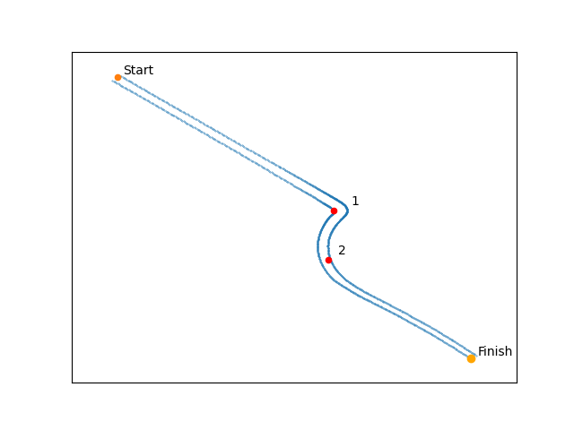
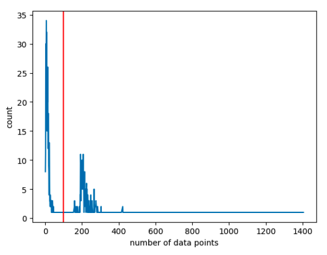
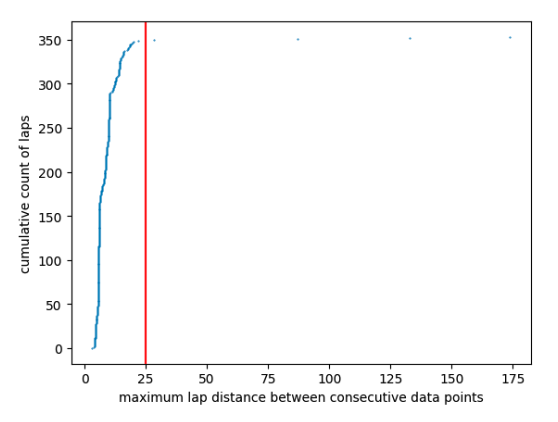
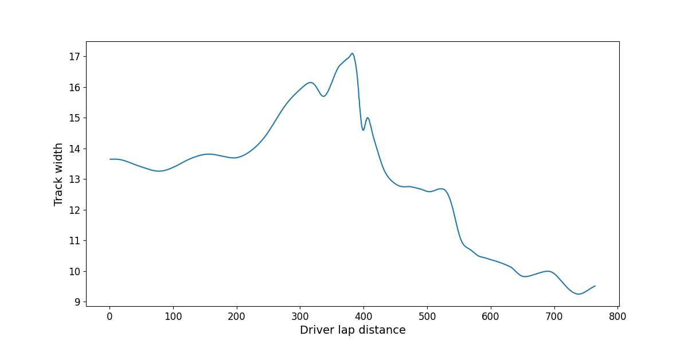
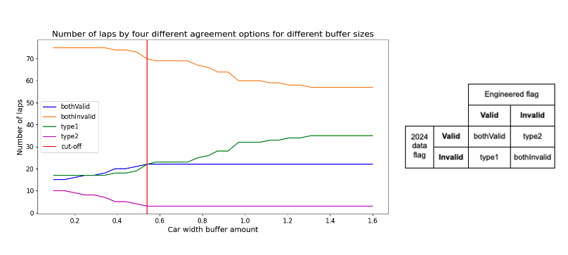

# Optimising Lap Times in Formula One: Data Product

## Project description
Every year in Formula One Racing, 10 teams each composed of 2 cars and drivers compete to finish first in the Grand Prix. To significantly facilitate this objective, teams strive to minimise their lap times. Teams continually assess how a driver can minimise lap time for each section of the track, implicating continual analysis and adjustments to maximise performance. Key attributes to maximise performance around corners include the optimal race line, speed, acceleration, braking, handling, and RPMs. Previous work on this topic has a stronger focus on mathematical derivations, with heavy use of techniques like Bayesian optimisation (Jain, 2020) and Euler spirals (Xiong, 2009). Other work uses different methods such as dynamic programming (Ingenious, 2023) but lacks the amount of data which our project provides.

This project aims to develop a data product that can be used as an input to a regression model that optimises the performance metrics in order to minimise the time taken to complete turns 1 and 2 of the Melbourne Grand Prix at Albert Park Circuit (see Figure 1). This project is significant as it will provide a level of high-quality and enriched data that was previously missing from this area of work.

|  |
|:--:|
| *Figure 1. The track section, consisting of turns 1 and 2 at the Albert Park Circuit.* |

## Sources
This project utilises data collected by Oracle at various events through EA Sports’ video games – F1 2022, F1 2023, and F1 2024. Participants of varying levels of driving skills, including general members of the public, were invited to attempt timed laps around the Albert Park circuit in a driving simulator. Each lap is captured through hundreds of data points taken at different points in time with detailed variables for driver inputs, car position, and car characteristics.

## Workflow
### Data cleaning
We began by cleaning the data. This involved ingesting all three datasets into a workflow, and correcting the column names so they were homogenous, as well as removing unnecessary columns. The F1 2024 data contained many more features, so separate analysis was done to see if any of these features (such as an INVALID_LAP flag) could be useful. We also ran checks to clean missing values in the data, and ran checks to ensure that all measurements were valid and fit within our understanding of the variables.

### Exploratory data analysis (EDA)
For our EDA, we had two main issues to explore: possible definitions for our key moments, and which features were most useful for describing a fast driver. Our EDA is further detailed below. 

### Data transformation
For our data transformation, we wrote a function for each new feature which, given the dataset, computes the new feature value. This ensures a clean workflow where each feature is contained, both for the purposes of readability and easy bug-fixing. We also developed a pipeline which, given the original dataset, produces the modelling dataset with one row corresponding to one lap.

To obtain our final data set, a user has to run the function titled build_dataset in the functions_final_features.py file. Other files: functions.py, functions_interpolation.py, functions_feature_computation.py, contain helper functions that build these features. All dependencies are documented in functions_final_features.py.

## Exploratory data analysis
### Finding the track section of interest
We filtered the track data to rows (data points) within the track section consisting of turns 1 and 2. We considered various cutoff points after lap 2. Given the goal is to minimise the time for the section, we are ending the section at a lap distance of 750m, which is a point between turns 2 and 3 where most ‘quality’ laps are still accelerating towards turn 3.

### Removing unsuitable laps
We aimed to identify very specific points within a lap (eg. first braking point, or lap distance 360m). However, there are many unique laps, for which an insufficient number of rows (data points) are provided. We chose removing laps with less than 100 data points as a suitable threshold, which balanced removing poor quality laps and keeping a sufficient quantity of data (see Figure 2). 

|  |
|:--:|
| *Figure 2. The number of laps by how many data points (rows) they contain. The vertical red line shows our cut-off point of 100 data points.* |

Furthermore, laps had large distances between data points (as measured by lap distance of the car when the measurements were taken). When there isn’t enough data provided these become very inaccurate estimations. By analysing the data (see Figure 3), we decided to filter out laps which had more than 25m between any two consecutive data points. 

|  |
|:--:|
| *Figure 3. Number of laps by the maximum distance between consecutive data points. The vertical red line shows our cut-off point of 25m between data points.* |

### Choosing and defining key moments
After devising to format the final data product with ‘features at a moment’, we had to select appropriate moments. Based on research and discussions with mentors, we knew that the points of braking, throttle and turning were significant. 

To identify the lap distances for our fixed distance, key moments between Turns 1 and 2, we selected five evenly spaced points between the apex of each turn. Additionally, we included one point just before and one point just after this section for further analysis. We decided to choose points at fixed distances to capture the data as we found the drivers make drastically different decisions at different points between the turns. A moment-based data model (such as capturing information at the first braking point between turns 1 and 2) may better encapsulate data for some drivers, it would leave other drivers with lots of null values, as many drivers simply chose not to brake between these turns. Using fixed distances ensures a robust model where information is captured, regardless of each driver’s individual decisions between the turns.

To identify the first significant steering point, we established a threshold to account for the minor steering inputs that often occur even on straights. After conducting EDA and graphing turning points, we determined that a threshold of 0.075 aligned with the start of most drivers' turns.

|  |
|:--:|
| *Figure 4. The steering amount applied by drivers (y-axis) at various lap distances (x-axis). The red line shows the threshold of 0.075, below which we consider that drivers are not making a serious attempt to turn the car. The apex of turn 1 is at a lap distance of 385m.* |

## Feature engineering
### Calculating track width
The feature of the width of the track was not provided to us. However, we were able to produce this feature by first finding some examples of laps that stayed on the track and contained a high number of data points in the relevant section. This ended up being 3 laps with a total of 508 rows of data. Then, we calculated the track width for each of these rows by finding the perpendicular distance from the left and right sides of the track to the position of the car and summing these values. This gave us a smooth curve of the width of the track for 508 different values of LAP_DISTANCE (shown in Figure 5). We use this curve to calculate the width of the track for any given LAP_DISTANCE, by linear interpolation.

|  |
|:--:|
| *Figure 5. The track width across lap distances.* |

### Flagging when cars go off-track
To identify when the cars went off track, we again calculated a car’s perpendicular distance from both the left and right sides of the track and added these values together. If this distance is greater than the width of the track (plus some additional buffer for the width of the car) at that moment in time, then the car must be off the track. It’s important to note that this only holds because we are calculating the perpendicular distance from the edge of the track to the car position. However, as mentioned, we need a buffer for the width of the car, as the coordinates we were provided do not account for this. We were provided with an INVALID_LAP flag in the 2024 data set, which provided a boolean for if the car went off track at any point in the entire lap, not just the specified section. We were able to use this for testing to determine an appropriate value for half the car's width. From Figure 6, we decided to use a buffer size of 0.54, based on a hockey stick argument for when type 2 error is minimised. For an explanation of the labels on Figure 6, see the adjacent table.

|  |
|:--:|
| *Figure 6. Our analysis of car width buffer amount based on the amount of agreements with the provided 2024 INVALID_LAP flag. The table on the right explains the legend for the graph and the four different agreement options..* |

After we built this flag to determine if cars went off track, we could easily build an INVALID_LAP flag, which is true if a car went off track at any point in the lap section.

## Data description
Our modelling dataset will contain one row for each lap attempted by each driver, resulting in 923 total rows. The features will contain information about:
- The entire lap
- Each driver-specific key moment in the track section (e.g. first point of braking, point of maximum throttle)
- Each distance-specific key moment in the track section (e.g. lap distance of 360m)
- Characteristics between distance-specific key moments (e.g. total throttle applied between lap distances 360m and 387m)

### Lap Information
In addition, the dataset will contain the following features to describe the characteristics of the attempt through the section as a whole. Note that SESSION_IDENTIFIER and LAP_NUM are not intended for modelling, but retained as they allow each lap attempt to be uniquely identified.
| Feature  | Column name  | Data type | Restrictions | Description |
| ------------- | ------------- | ----- | ------ | ------ |
| Session ID | SESSION_IDENTIFIER | String |None | The ID of the session in which the lap was completed |
| Lap number | LAP_NUM | Integer | Greater than 0 | The number lap the driver is on |
| Whether the path was invalid | INVALID_LAP | Boolean |True/False | True if the car went off the track during the section up to lap distance 750m |
| Time taken | SECTION_TIME_MS | Integer | Greater than 0 | The time taken to complete the section ending at lap distance 750m, in milliseconds |
| Year | YEAR | String | 2022, 2023 or 2024 | The year in which the lap was recorded |

### Key Moments
We have chosen key moments from the track section as follows:
| Key Moment  | Feature Prefix | Description |
| ----------- | -------------- | ----------- |
| Point of first braking | FB | The point when the driver begins to brake (presumably leading into turn 1). This is defined as the first point where BRAKE > THROTTLE. |
| Point of maximum braking | MB | The point where the BRAKE reaches its maximum value. |
| First point of steering | FS | The point where the driver makes an initial significant turn of the wheel. This is defined as the first point where the absolute value of STEERING is greater than 0.075. |
| Point of maximum steering | MS | The point where the driver has hit their maximum STEERING amount. |
| Point of first throttle after initial brake | FT | The point when the driver first applies throttle after braking. This is defined as the first point where THROTTLE > BRAKE after the driver has already braked (as defined by the Point of first braking moment). |
| Point of maximum throttle after initial brake | MT | The point when the driver applies the maximum THROTTLE after braking. |
| Fixed distance point at 360m | 360 | The point where the driver is closest to a LAP_DISTANCE of 360m. |
| Fixed distance point at 387m | 387 | The point where the driver is closest to a LAP_DISTANCE of 387m. |
| Fixed distance point at 414m | 414 | The point where the driver is closest to a LAP_DISTANCE of 414m. |
| Fixed distance point at 441m | 441 | The point where the driver is closest to a LAP_DISTANCE of 441m. |
| Fixed distance point at 468m | 468 | The point where the driver is closest to a LAP_DISTANCE of 468m. |
| Fixed distance point at 495m | 495 | The point where the driver is closest to a LAP_DISTANCE of 495m. |
| Fixed distance point at 522m | 522 | The point where the driver is closest to a LAP_DISTANCE of 522m. |

### Information at Key Moments
For each of the key moments, the following measurements will be included:
| Feature  | Column name  | Data type | Restrictions | Description |
| ------------- | ------------- | ----- | ------ | ------ |
| Distance from left track edge | DIST_FROM_LEFT | Float | Greater than 0 | Distance from the left side of the track that the car is at when it begins to brake leading into turn 1 |
| Distance from right track edge | DIST_FROM_RIGHT | Float | Greater than 0 | Distance from the right side of the track that the car is at when it begins to brake leading into turn 1 |
| X position of the car | XPOS | Float | None | The x position of the car relative to the game’s coordinate system |
| Y position of the car | YPOS | Float | None | The y position of the car relative to the game’s coordinate system |
| Speed of the car | SPEED | Float | Greater than 0 | The speed the car is travelling at the key moment |
| Lap distance | LAP_DIST | Float | Between 0 and 5280 | How far from the start line the car has travelled at the key moment |
| Throttle amount | THROTTLE | Float | Between 0 and 1 | Amount of throttle the driver is applying |
| Brake amount | BRAKE | Float | Between 0 and 1 | Amount of brake the driver is applying |
| Turning amount | STEERING | Float | Between -1 and 1 | Steering direction/strength the driver is applying |
| Moment timestamp | CURR_LAPTIME | Float | Greater than 0 | Timestamp of the moment - particularly useful when comparing moments |
| Gear | GEAR | Integer | Between -1 and 8 | The gear shifted into. See Use of GEAR and ENGINE_RPM columns for details on use. |
| Revolutions per minute | ENGINE_RPM | Float | Greater than 0 | The revolutions per minute by the engine. See Use of GEAR and ENGINE_RPM columns for details on use. |
| Distance from first apex | DIST_APEX_1 | Float | Greater than 0 | The straight line distance from the first apex | 
| Distance from second apex | DIST_APEX_2 | Float | Greater than 0 | The straight line distance from the second apex | 
|Angle to first apex | ANGLE_APEX_1 | Float | Between -180 and 180 | The angle between the direction the car is facing, and the direction to the apex of turn 1. |
| Angle to second apex | ANGLE_APEX_2 | Float | Between -180 and 180 | Same as above for the apex of turn 2. |

Column name construction for key moments is:

    <key moment prefix> + ‘_’ + <key moment feature name>

For example, the column representing the car’s speed at the first braking point is named:

    FB_SPEED

### Information between key moments:
In addition to these, the dataset will contain the following features to consolidate what happens between the fixed-distance moments:
| Feature  | Column name  | Data type | Restrictions | Description |
| ------------- | ------------- | ----- | ------ | ------ |
| Total throttle | TOTAL_THROTTLE | Float | At least 0 | The total throttle between moments, found by integration |
| Total braking | TOTAL_BRAKING | Float | At least 0 | The total braking between moments, found by integration |

Column name construction for information between fixed moments is:

	<feature name> + ‘_’ + <first key moment prefix> + ‘’ + <second key moment prefix>

For example, the column representing the total throttle between moments at lap distances of 360m and 387m is named:

	TOTAL_THROTTLE_360_387

### Use of GEAR and ENGINE_RPM columns
Stuart Coggins, the Oracle representative, advised us that all of the lap data was obtained from the cars driving with **automatic transmission (AT)**, aside from Max Verstappen’s lap in the 2024 data, which was driven with **manual transmission (MT)**. Swapping between a MT and an AT is a setting that can be changed within the video game. We have observed certain lap times within the data that we believe would be impossible to obtain with an AT, hence we believe that some laps were driven with an AT, and some with a MT, without any indication of which laps fall into which category. Our analysis of gear and rpm patterns failed to provide any insight into distinguishing between MT and AT laps. As a result, we have decided to include the **GEAR** and **ENGINE_RPM** columns in our data set, however, they should be utilised with caution. We believe including the GEAR and ENGINE_RPM columns will influence the analysis by assuming that all drivers had manual control over their GEAR and hence ENGINE_RPM during their drive. Alternatively, excluding these columns would assume the opposite. We advise the modelling team to be aware of these limitations, and the effect that prediction involving these columns has on their final model.

In total, we have:
- 6 key moments
- 7 fixed-distance moments
- 16 pieces of information at each moment
- 2 pieces of information between each pair of consecutive fixed-distance moments
- 5 pieces of information for the entire lap

This results in a total of 225 columns.

## Usage
Our final output will be a wide data set, where each row represents a lap of the track. This should be used as input for an analytical model with the aim to optimise the driver inputs and positions needed to achieve the quickest time through the lap section whilst having a very low probability of going off track.

We recommend modellers conduct EDA to find correlations and trends between driver input features and lap time. **It is unlikely that all of the provided feature columns will be useful in creating a good model.** Modellers should use technical analysis and qualitative understanding of the data to make judgements on this. 

This may look like using gradient boosting to predict lap time, and then trialling various inputs to determine the optimum. Alternatively, neural networks may be useful due to the complex relationships between the many driver inputs and target variables. **Note: these methods have not been trialled.**

Furthermore, modellers should carefully consider what type of features they want to have as a result. We categorise them into two groups - driver controlled inputs (eg. throttle amount, turning point) and resulting characteristics (eg. speed which the driver doesn’t directly set). 

Teams should employ their basic understanding and intuition of F1 driving, rather than relying solely on modelling techniques. For example:
- Are the optimal values feasible? (eg. reaching a speed of 1000km/h isn’t possible)
- Do the values make sense? (eg. a model indicating no braking throughout the entire section being the fastest and still on track probably isn’t correct)

## Support
If a user requires assistance, please reach out to one of the following:
- Kiran Singh: z5488154@ad.unsw.edu.au
- Kento Seki: z5366832@ad.unsw.edu.au
- Tom Smelt: z5363052@ad.unsw.edu.au
- Lily Miranda: z5419745@ad.unsw.edu.au
- Jisung (Steve) Park: z5417198@ad.unsw.edu.au

## Contributors
- Data transformation:
   - [Kento Seki](https://github.com/kento-seki)
   - [Lily Miranda](https://github.com/lily-uni)
   - [Tom Smelt](https://github.com/tomsmelt)
   - [Kiran Singh](https://github.com/kirandolo)
   - [Steve Park](https://github.com/JPark454)
- Data source:
   - Oracle - Stuart Coggins
- Guidance and education:
   - [David Warton](https://github.com/dwarton)

## How can you get involved?
- Identify other obscure factors that could affect time
- Compute more columns using the data that allows for further analysis 
- Create simulations to test and evaluate all factors that could affect time
- Import external data for further accuracy 

## References
Ingenious 2023, *YouTube*, accessed 15 September 2024, \<https://www.youtube.com/watch?v=BuqoSJFyvVE&ab_channel=Ingenious>.

Jain, A 2020, 'Computing the racing line using Bayesian optimization', Cornell University, accessed 16 September 2024, \<https://arxiv.org/abs/2002.04794>.

Xiong, Y 2009, 'Racing Line Optimization', Master's thesis, Massachusetts Institute of Technology, accessed 15 September 2024, \<https://dspace.mit.edu/bitstream/handle/1721.1/64669/706825301-MIT.pdf>.
